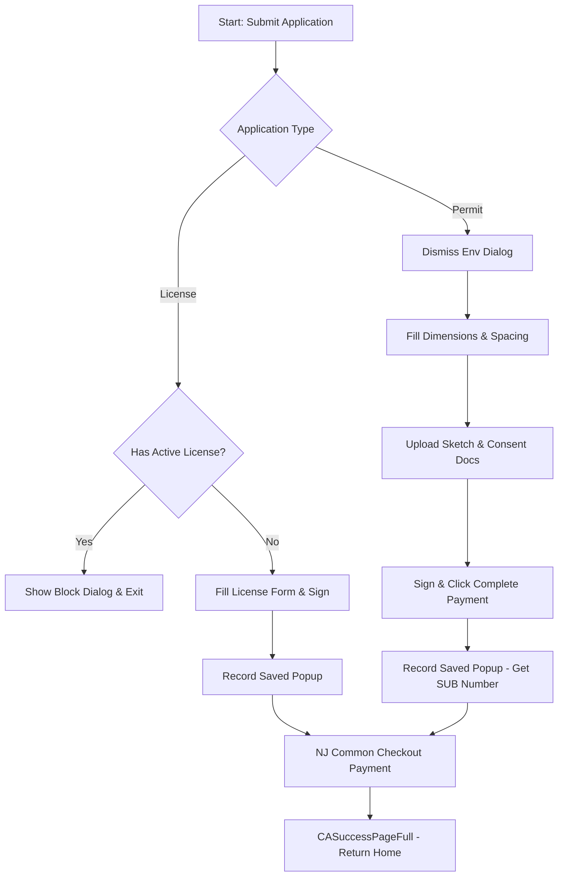
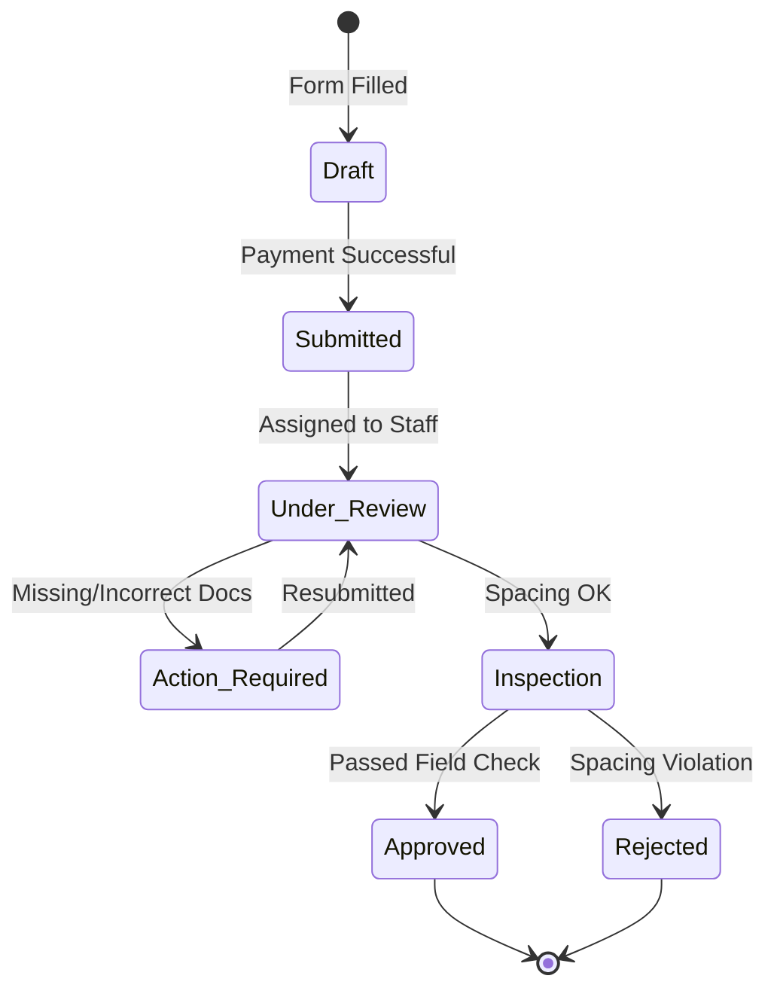

# NJDOT Outdoor Advertising Customer Portal - Comprehensive Reference Guide

This document is a SharePoint-ready reverse-engineered knowledge base for the **NJDOT Outdoor Advertising (ODA) Customer Portal**. It details the business logic, functional processes, data validations, and test automation structure for developers, business analysts, product owners, and QA architects.

---

## 1. Executive Summary
The New Jersey Department of Transportation (NJDOT) regulates all roadside signboards, highway billboard structures, and outdoor advertising licenses along state highways. The **NJDOT Outdoor Advertising Customer Portal** is the public-facing e-permitting module. It allows external advertisers, agents, and property owners to register profiles, apply for licenses, submit sign permits, request permit transfers, and process payments. This system ensures roadside safety compliance, protects public aesthetics, and manages the collection of state regulatory fees.

---

## 2. Module Overview
The customer portal is organized into distinct sub-modules:
- **Authentication & Security**: Email-based logins, credential verification, and user session management.
- **Account Registration (Profile Management)**: Organization registry that changes layouts dynamically depending on Disadvantaged Business Enterprise (DBE/SBE) status.
- **Submit Application Drawer**: Dispatch menu for:
  - License Applications
  - Permit Applications
  - Permit Transfers
  - Name Changes
- **Action Items Grid**: Grid showing pending notifications or corrections requested by NJDOT staff.
- **Applications History Grid**: Log of all past submissions, statuses, and details with export support.
- **Payment Activity Grid**: Transaction history and receipts log with time period filters.
- **Payment Gateway**: Integration with the NJ Common Checkout checkout portal for CC payment processing.

---

## 3. Business Purpose
- **Regulatory Compliance**: Enforces New Jersey highway billboard safety spacing, size limitations, and zoning laws (Title 27 and NJAC 16:41C).
- **Revenue Operations**: Receives and logs non-refundable application and annual renewal fees.
- **Audit & Inspections**: Gathers location sketches, coordinates, and owner consents to schedule field inspections.

---

## 4. User Roles & Permissions
- **Independent Dealer / Owner**: Full access to register profiles, submit licenses/permits, request transfers, and process payments.
- **Appointed Agent**: Acts on behalf of dealers/owners to submit designs and inspect permit logs.
- **Property Owner**: Grants consent for sign installation on private properties.
- **NJDOT Staff / Approver (Staff Portal)**: Backend reviewer who performs zoning checks, schedules physical inspections, audits payment logs, and approves/rejects submissions.

---

## 5. Functional Overview
The system coordinates five core functional layers:
1. **Profile Registry**: Captures tax profiles, billing coordinates, and POC info.
2. **Structure Permit Requests**: Processes dimensions, sign material, spacing, highway mileposts, and location sketches.
3. **License Management**: Checks that a tax entity holds an active, valid license before permit ownership is allowed.
4. **Location Chain-of-Custody**: Transfers permit ownership safely between registered businesses.
5. **Fee Checkout Integration**: Locks application review queues until fees clear via the New Jersey Common Checkout portal.

---

## 6. End-to-End Workflows

### Workflow 1: Account Registry (DBE/SBE vs Regular)
- **Step-by-step user actions**:
  1. Click "Create an Account" on login screen.
  2. Select "Yes" or "No" to the DBE/SBE prompt.
  3. Fill out profile details (street address, city, zip, phone, officers, POC).
  4. Submit profile.
- **Business Decisions**: If DBE, the "Company Name" is hidden (pulled automatically from certified DBE registries). If Non-DBE, "Company Name" and "Federal DBE ID" are mandatory inputs.
- **Validations**: Enforces exactly 5 digits on zip codes; POC Email and POC Confirm Email must match.
- **Expected Outcome**: Account is registered in the database as "Pending Validation".

### Workflow 2: Outdoor Advertising License Application
- **Step-by-step user actions**:
  1. Navigate to Submit Application panel and click "License Application".
  2. Fill out comments/placeholder text fields.
  3. Accept statutory terms and input signature details.
  4. Click "Complete Payment".
  5. Enter credit/debit card details on NJ Common Checkout.
  6. Click Submit and return to the success screen.
- **Business Decisions**: System checks if the account already holds an active license. If yes, it launches a blocking popup and skips.
- **Validations**: Enforces signature name/title before activating the complete payment button.
- **Expected Outcome**: License is saved, paid, and queued for review.

### Workflow 3: Outdoor Advertising Structure Permit Application
- **Step-by-step user actions**:
  1. Click "Permit Application".
  2. Dismiss the environment confirmation modal.
  3. Enter sign face height and width.
  4. Select Sign Type and Sign Material from dropdowns.
  5. Select County (e.g. Atlantic) and enter milepost location.
  6. Upload the Site Location Sketch document.
  7. Fill Property Owner details and upload Property Owner Consent.
  8. Click Complete Payment.
  9. Enter card details on the checkout gateway and submit.
- **Validations**: Face dimensions must be positive integers. Location sketch and Property Owner Consent are mandatory uploads.
- **Expected Outcome**: System generates a SUB reference number (e.g., `SUB-2026-X`) and routes the application to the NJDOT queue upon successful payment.



---

## 7. Navigation Flow
```
Login Portal
  |
  +-- Create Account Option --> DBE/Non-DBE Form Selection
  |
  +-- Authenticate User --> Application Select Page
                              |
                              +--> ODA Customer Dashboard
                                     |
                                     +-- Submit Application Menu
                                     |     |-- License Application Form
                                     |     |-- Permit Application Form
                                     |     |-- Permit Transfer Form
                                     |     +-- Name Change Form
                                     |
                                     +-- Action Items Grid
                                     +-- Applications History Grid
                                     +-- Payment Activity Grid
```

---

## 8. Business Rules
1. **Zoning Restriction**: Structure permits are blocked if they do not specify a valid New Jersey county.
2. **License Mandate**: Users cannot acquire permits unless their organization holds an active license.
3. **No Fee for Name Change**: Name change corrections are processed for free.
4. **Draft Deletion**: Unpaid drafts are automatically deleted or ignored by backend inspectors after 60 days.

---

## 9. Required Fields & Validations
- **Face Width/Height**: Positives integers (feet).
- **County Selection**: Selected from Kendo dropdown list.
- **Zip Code**: 5 digits numeric.
- **Phone Numbers**: Formatted as `XXX-XXX-XXXX`.

---

## 10. Status Flow & Lifecycle
1. **Draft / Unpaid**: Initial state before checkout.
2. **Submitted / Paid**: Paid; visible to NJDOT staff.
3. **Under Review**: Assigned to an analyst.
4. **Inspection**: Field engineer scheduled to check highway metrics.
5. **Approved / Issued**: Approved; PDF copy of permit released.
6. **Returned / Action Required**: Applicant needs to provide corrections.
7. **Rejected**: Application closed and fee forfeited.



---

## 11. Approval Workflow
- **Customer Portal**: Enters details, uploads consent/sketches, pays fee.
- **Staff Portal**:
  1. Review documents (Consent, Sketch).
  2. Verify local zoning.
  3. Inspection record created; Spacing and setback verified.
  4. Final manager sign-off.
  5. Document issued to customer portal.

---

## 12. Data Requirements
- **POC Details**: Name, unique email, matching confirm email, phone.
- **Dimensions**: Precise width/height of the billboard face.
- **Billing Coordinate**: Address matching corporate registries.

---

## 13. UI Components & Controls
- **Kendo UI Grid**: Paginates and displays historical logs.
- **Kendo Dropdown**: Dynamic search lists for county/state fields.
- **Kendo Upload**: Asynchronous upload controller.
- **Kendo NumericTextBox**: Input filters enforcing numbers.

---

## 14. Document Upload/Download Workflow
- **Upload**: Handled via `.k-upload` input elements. Verifies green checkmark icon (`.k-file-success` or `.k-i-check`) upon completion.
- **Download**: Exports data spreadsheets directly or launches authenticated popup windows (`DocumentView?document_id=...`) to view generated PDFs.

---

## 15. Search & Grid Functionality
- **Dynamic Search**: Client-side grid queries using text inputs.
- **Fast Pagination**: Skips directly to pages using spinboxes.
- **Excel Export**: Triggers file downloads directly from grids.

---

## 16. Integration Points
- **NJ Common Checkout**: State checkout system redirect.
- **DBE Certification Database**: Automatic profile lookup.
- **NJDOT GIS Map**: Verifies state highway mileposts and setbacks.

---

## 17. Error Handling & Validation Rules
- **Login Failures**: Popups indicating "You have entered an invalid email address or password" are caught and dismissed.
- **Empty Fields**: Warnings like "Email is mandatory" block logins.

---

## 18. Automation Coverage Summary
The portal is automated with a Python-based Playwright framework:
- Uses Page Object Models (POMs) for clean element separation.
- Integrates Faker for dynamic registration/form entries.
- Parallel execution handles session setups using custom staggering delays and cross-process locks.

---

## 19. Test Scenarios Covered
1. `test_portal_login_and_logout`: Complete login, app select, and logout.
2. `test_login_empty_credentials`: Asserts mandatory field warning blocks.
3. `test_login_invalid_password` & `test_login_invalid_email`: Verifies modal alerts are caught and dismissed.
4. `test_create_account_dbe_yes` & `test_create_account_dbe_no`: Organization profiling.
5. `test_license_application_payment`: Fills comments, triggers checkout, validates card processing.
6. `test_permit_application_popup`: Structure permitting, handles domain popup, uploads consent and sketch, payments.
7. `test_permit_transfer_payment`: Fills transfer info, uploads document, checkout.
8. `test_name_change_flow`: Corrects entity name, success page navigation.
9. `test_action_items_pagination`: Tests large grid volumes and paginates.
10. `test_applications_history_export`: Filter clearances and history exports.
11. `test_payment_activity_filters`: Alternates time periods and exports records.

---

## 20. Gaps & Missing Coverage
- **File Upload Limits**: Boundary tests for large files or invalid file extensions.
- **Session Expiry**: Automation flows checking behavior when page tokens expire.
- **Browser Compatibility**: Test suites are primarily chromium-based; safari and firefox tests need inclusion.

---

## 21. Known Limitations
- **AJAX Syncing**: Kendo widgets require explicit wait wrappers rather than static timeouts.
- **Zoom Layout Shift**: CSS zooms can misalign checkboxes, necessitating force-click interactions.

---

## 22. Team Knowledge Base
- **Auth Cache**: Stored in `.auth/` directory. Delete to force physical login.
- **Kendo Interaction**: Avoid typing values; utilize helper scripts (`_select_first_valid_option`) to trigger events correctly.

---

## 23. AI Learning Notes
- **Inline Popups**: Capturing inline PDFs requires page popup event listeners and raw bytes request fetches.
- **Serial Login Locks**: Staggering logins ensures parallel runs don't create login session overrides.

---

## 24. Future Automation Opportunities
- **Notification Checking**: Automate email box reading to verify links.
- **Manager Approval**: End-to-end automation spanning Customer Portal Submission -> Staff Portal Approval.

---

## 25. Future Product Enhancements
- **State Database Registry**: Auto-fill addresses via tax ID.
- **GIS Coordinate Selector**: Interactive map pin-drop coordinate input.
- **Receipt Dashboard**: Direct access to invoice PDFs in payment activity grids.
